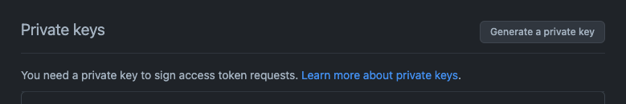

# TODO's:
Próximos passos:
## 1) Liberando o acesso a API com Token

* Gerar uma private-key via GitHub UI conforme o screenshot abaixo:
.

* Salvar o arquivo .pem em um diretório acessível para o Script (generate-jwt.py)

* Realizar o flow do POPUP e capturar o Installation ID retornado para informar para o Script.

* Executar o script "generate-jwt.py" para gerar o JWT token.

* Realizar uma chamada via POST para o end-point abaixo:

```
https://api.github.com/app/installations/{{installation_id}}/access_tokens
```
Detalhes desta chamada em: 
[Create an installation access token for an app](https://docs.github.com/en/rest/apps/apps?apiVersion=2022-11-28#create-an-installation-access-token-for-an-app)

```
$ -> python3 generate-jwt.py private-key.pem 291264
```


Esta chamada retornará algo como:
```
{
    "token": "XXXXXX",
    "expires_at": "2023-02-09T14:36:47Z",
    "permissions": {
        "contents": "read",
        "metadata": "read"
    },
    "repository_selection": "all"
}
```

Este token retornado será o que devemos utilizar nas chamadas seguintes para a API.

## 2) Realizando a chamada para acessar os repositórios:


